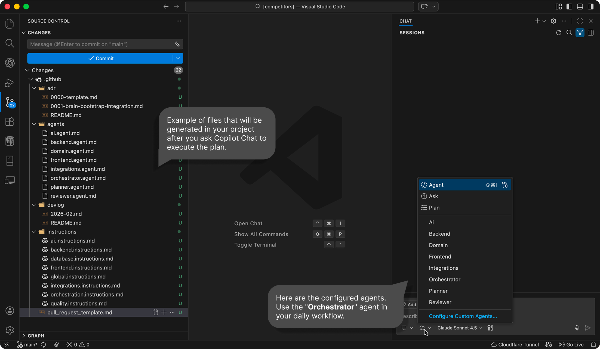

<kbd>English</kbd> | <kbd>[Português](README_PT.md)</kbd>

# 🤖 AI Legacy Orchestration
> Created by Edelcio Molina to bring structure to AI-assisted legacy development - see [my motivation](./MOTIVATION.MD)


 
AI Legacy Orchestration is a practical guide that leverages GitHub Copilot's native capabilities to prepare your legacy project for intelligent, safe, and hallucination-resistant work in legacy codebases by introducing:


* Explicit agent orchestration
* Always-on governance rules
* Formal decision tracking (ADR)
* Functional change summaries (DevLog)
* Pull request enforcement templates

This is not a tool.
It is not an extension.
It is a method for structuring how AI is used in real projects.

---

## 🚧 The Current Problem

Most teams use AI like this:

```
Request → Code → Commit
```

In legacy systems, this quickly leads to:

* Implicit architectural decisions
* Inconsistent conventions
* Untraceable changes
* Increased codebase entropy
* Over-reliance on individual developer context

This project proposes a minimal structure to bring discipline to AI usage.

---

## 🧰 What This Process Adds to Your Repository

After applying the setup, your repository includes:

```
.github/
 ├── agents/
 ├── instructions/
 └── pull_request_template.md

docs/
 ├── adr/
 └── devlog/
```

### 🧑‍💼 `.github/agents/`

Defines agents with explicit responsibilities:

* `orchestrator.agent.md`
* `planner.agent.md`
* `reviewer.agent.md`
* specialized agents (when applicable)

### 📜 `.github/instructions/`

Contains:

* `orchestration.instruction.md` (always active)
* `global.instruction.md` (always active)
* optional contextual instructions

### 🧠 `docs/adr/`

Records relevant architectural decisions.

### 📝 `docs/devlog/`

Records relevant functional changes.

---

## ⚙️ How It Works

Every request follows this flow:

```
User
  ↓
Orchestrator
  ↓
Planner
  ↓
Specialized Agent (if needed)
  ↓
Reviewer
```

The goal is not bureaucracy.
It is to:

* Prevent silent architectural decisions
* Avoid skipping critical steps
* Enforce minimal review
* Record meaningful changes

---

## ✅ When to Use It

Recommended for:

* Legacy systems under active maintenance
* Large monorepos
* Systems with multiple integrations
* Teams already using Copilot regularly
* Projects requiring technical traceability

It can also be used for greenfield projects, but the biggest impact is in existing codebases.

---

## 🚀 How to Apply

1. Open the repository in VS Code.
2. Open GitHub Copilot Chat.
3. Select **Plan Mode**.
4. Use a strong reasoning model (Claude Sonnet, GPT Codex, or AUTO).
5. Copy the contents of [github-copilot-en.md](https://raw.githubusercontent.com/edelciomolina/ai-legacy-orchestration/refs/heads/main/github-copilot-en.md), paste it into the chat, send, and wait.
6. All set - whenever you want Copilot to act more intelligently and in a structured way, select the **Orchestrator** agent and start your request there.

The setup will:

* Analyze the repository structure
* Create the appropriate agents
* Create always-on instruction files
* Create ADR and DevLog structure
* Create a PR template
* Provide a summary report

---


## 📚 How Copilot Will Navigate

Through the instructions contained in **[github-copilot-en.md](https://raw.githubusercontent.com/edelciomolina/ai-legacy-orchestration/refs/heads/main/github-copilot-en.md)**, the model chosen for plan processing will operate with the following topics to produce the intelligence structure in your legacy project.

* Which model to use
* When to use Plan Mode
* How to start via the Orchestrator
* When to create an ADR
* When to update the DevLog
* The recommended workflow

---

## 🚫 What This Project Is Not

* It is not a replacement for architecture.
* It is not a coding framework.
* It is not a compliance automation system.
* It does not prevent bad decisions - it makes them explicit.

---

## 🎯 Objective

Introduce a minimal layer of structure to AI usage in real repositories.

No promises.
Just process.
No hype.
