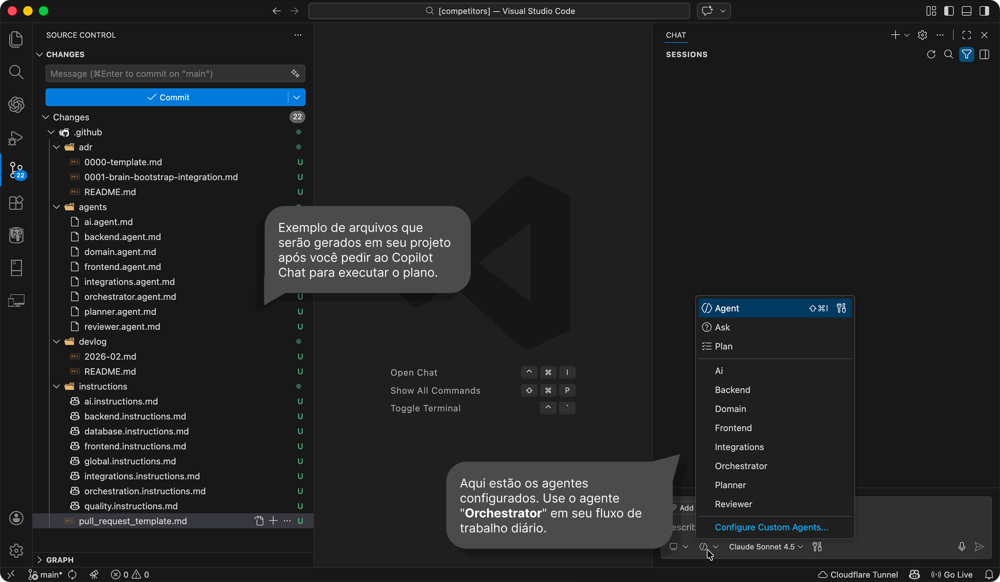

<kbd>[English](README.md)</kbd> | <kbd>Português</kbd>

# 🤖 AI Legacy Orchestration
> Criado por Edelcio Molina para trazer estrutura ao desenvolvimento legado assistido por IA — veja [minha motivação](MOTIVATION_PT.md)


 
AI Legacy Orchestration é um processo estruturado para organizar o uso do GitHub Copilot em repositórios existentes — especialmente bases de código legadas — introduzindo:

* Orquestração explícita de agentes
* Regras de governança sempre ativas
* Rastreamento formal de decisões (ADR)
* Resumos funcionais de mudanças (DevLog)
* Templates de pull request com enforcement

Isso não é uma ferramenta.
Não é uma extensão.
É um método para estruturar como a IA é usada em projetos reais.

---

## 🚧 O Problema Atual

A maioria das equipes usa IA assim:

```
Solicitação → Código → Commit
```

Em sistemas legados, isso rapidamente leva a:

* Decisões arquiteturais implícitas
* Convenções inconsistentes
* Mudanças não rastreáveis
* Aumento da entropia da base de código
* Dependência excessiva do contexto individual dos desenvolvedores

Este projeto propõe uma estrutura mínima para trazer disciplina ao uso de IA.

---

## 🧰 O Que Este Processo Adiciona ao Seu Repositório

Após aplicar a configuração, seu repositório inclui:

```
.github/
 ├── agents/
 ├── instructions/
 └── pull_request_template.md

docs/
 ├── adr/
 └── devlog/
```

### 🧑‍💼 `.github/agents/`

Define agentes com responsabilidades explícitas:

* `orchestrator.agent.md`
* `planner.agent.md`
* `reviewer.agent.md`
* agentes especializados (quando aplicável)

### 📜 `.github/instructions/`

Contém:

* `orchestration.instruction.md` (sempre ativa)
* `global.instruction.md` (sempre ativa)
* instruções contextuais opcionais

### 🧠 `docs/adr/`

Registra decisões arquiteturais relevantes.

### 📝 `docs/devlog/`

Registra mudanças funcionais relevantes.

---

## ⚙️ Como Funciona

Toda solicitação segue este fluxo:

```
Usuário
  ↓
Orquestrador
  ↓
Planejador
  ↓
Agente Especializado (se necessário)
  ↓
Revisor
```

O objetivo não é burocracia.
É:

* Prevenir decisões arquiteturais silenciosas
* Evitar pular etapas críticas
* Impor revisão mínima
* Registrar mudanças significativas

---

## ✅ Quando Usar

Recomendado para:

* Sistemas legados sob manutenção ativa
* Grandes monorepos
* Sistemas com múltiplas integrações
* Equipes que já usam Copilot regularmente
* Projetos que exigem rastreabilidade técnica

Também pode ser usado para projetos greenfield, mas o maior impacto é em bases de código existentes.

---

## 🚀 Como Aplicar

1. Abra o repositório no VS Code.
2. Abra o GitHub Copilot Chat.
3. Selecione **Plan Mode**.
4. Use um modelo de raciocínio forte (Claude Sonnet, GPT Codex, ou AUTO).
5. Copie o conteúdo de [github-copilot-pt.md](https://raw.githubusercontent.com/edelciomolina/ai-legacy-orchestration/refs/heads/main/github-copilot-pt.md), cole no chat, envie e aguarde.
6. Pronto — sempre que quiser que o Copilot atue de forma mais inteligente e estruturada, selecione o agente **Orchestrator** e comece sua solicitação por lá.

A configuração irá:

* Analisar a estrutura do repositório
* Criar os agentes apropriados
* Criar arquivos de instrução sempre ativos
* Criar estrutura ADR e DevLog
* Criar um template de PR
* Fornecer um relatório resumido

---

## 📚 Como o Copilot vai se nortear

Por meio das instruções contidas em **[github-copilot-pt.md](https://raw.githubusercontent.com/edelciomolina/ai-legacy-orchestration/refs/heads/main/github-copilot-pt.md)** o modelo escolhido para processamento do plano vai atuar com os seguintes tópicos para produzir a estrutura de inteligência em seu projeto legado. 

* Qual modelo usar
* Quando usar o Plan Mode
* Como começar via Orquestrador
* Quando criar um ADR
* Quando atualizar o DevLog
* O fluxo de trabalho recomendado

---

## 🚫 O Que Este Projeto Não É

* Não é uma substituição para arquitetura.
* Não é um framework de código.
* Não é um sistema de automação de conformidade.
* Não previne decisões ruins — as torna explícitas.

---

## 🎯 Objetivo

Introduzir uma camada mínima de estrutura ao uso de IA em repositórios reais.

Sem promessas.
Apenas processo.
Sem hype.
